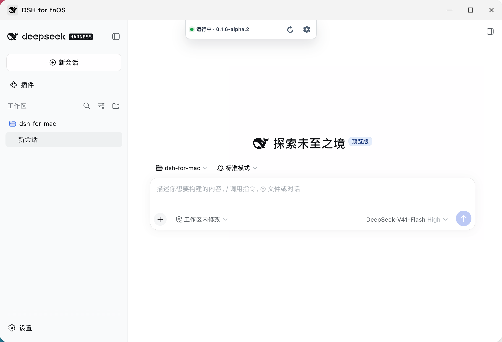
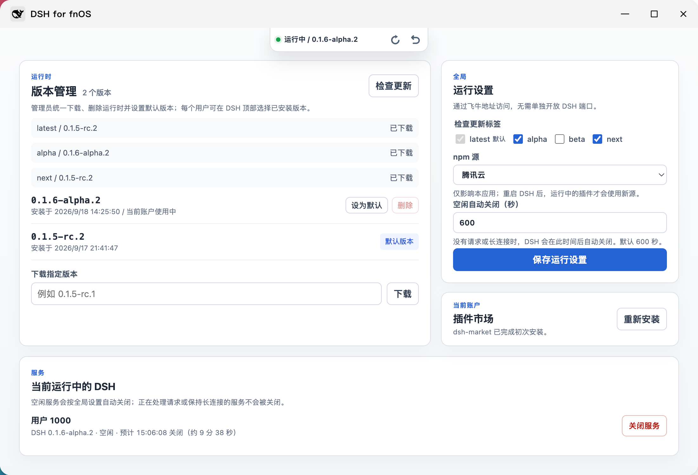
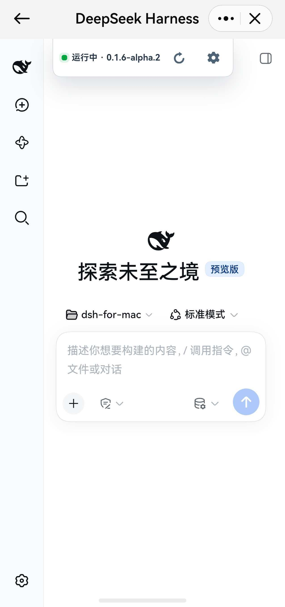
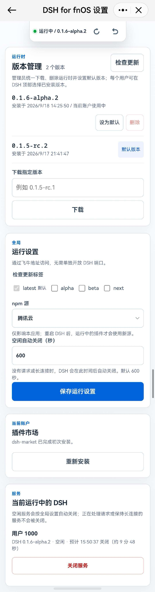

# DSH for fnOS

DSH for fnOS 在飞牛 NAS 上为每个用户按需运行独立的 DeepSeek Harness（DSH）实例。每个用户首次打开时在自己的飞牛主目录中选择并授权一个 DSH 工作目录，DSH 配置、插件、会话和工作区保存在该目录；管理员统一下载运行时，用户可从已安装版本中选择。

## 界面预览

<table>
  <tr>
    <td width="50%" align="center">
      <a href="screenshots/pc-1.png"></a><br>
      <sub>桌面端主界面</sub>
    </td>
    <td width="50%" align="center">
      <a href="screenshots/pc-2.png"></a><br>
      <sub>桌面端设置界面</sub>
    </td>
  </tr>
</table>

<p align="center">
  <a href="screenshots/mobile-1.jpg"></a>
  &nbsp;&nbsp;&nbsp;
  <a href="screenshots/mobile-2.jpg"></a>
</p>
<p align="center"><sub>移动端主界面与设置界面</sub></p>

## 功能

- 通过飞牛统一网关 `/app/dsh-for-fnos/` 访问，主界面位于其 `dsh/` 子路径；无需额外开放 3080 端口。
- 根据网关提供的飞牛 UID 路由到独立 DSH 子进程；子进程仅侦听系统分配的回环临时端口。
- 顶部状态岛支持切换已安装版本、重启当前实例和授权额外个人目录，并适配飞牛手机端安全区与触控操作。
- 默认检查 npm `latest`，可附加 `alpha`、`beta`、`next`；可下载精确版本并手动启用。
- 每个 DSH 版本独立安装并校验包名、版本和 lockfile integrity；安装数量不设上限，管理员可删除未被设为默认或任何用户选用的版本。
- 启用新版本会先完成健康检查，失败则尝试恢复原版本。
- 首次成功启动自动安装 `dshmarket`；之后不会重复安装用户已移除的市场。
- 用户实例没有请求或长连接时会按管理员设置自动关闭（默认 600 秒）；活跃 HTTP、SSE 和 WebSocket 连接不会被中断。
- 插件安装、更新或卸载后会等待 dsh-market 连续确认操作结束，再自动重启 DSH 以加载变更。
- 代理保留官方 Web profile、插件机制和数据格式，透传插件 HTTP、静态资源、SSE 与 WebSocket；仅适配资源 URL，不改写插件 JavaScript 或 JSON 内容。

飞牛不允许应用直接授权用户主目录根；用户需选择其中的 DSH 工作目录。飞牛会在用户同意后把该目录及额外授权路径提供给本应用；DSH 只在该用户授权完成后启动。DSH 与第三方插件的跨版本兼容性由其各自维护。

## 本地开发

从仓库根目录执行：

```sh
pnpm install
pnpm run dev dsh
```

本机管理入口为 `http://127.0.0.1:3081/app/dsh-for-fnos/`，设置页为 `http://127.0.0.1:3081/app/dsh-for-fnos/settings/`。`3081` 仅用于本机开发，DSH 同样通过此端口的 `/app/dsh-for-fnos/dsh/` 访问。开发运行数据位于 `apps/dsh/.local/`，不会影响 NAS 上已有的应用数据。

```sh
pnpm test
pnpm run build dsh
pnpm run pack dsh --arch x86
pnpm run pack dsh --all
pnpm run check dsh
```

FPK 输出到根目录 `dist/release/`。当前应用依赖 fnOS 的 `nodejs_v24`，最低支持 fnOS 1.2.0401；手机端目录授权要求飞牛 App 1.34.0 或更高版本。同一份 Node.js 源码可分别打包为 x86 与 arm FPK。
`pnpm run pack dsh` 每次都会先重新构建，避免把旧 `dist/` 内容打进新 FPK；单独执行 `pnpm run build dsh` 可检查构建结果。

## 源码结构

```text
src/app/        Node.js 入口与安装初始化
src/server/     fnOS 网关管理服务与 DSH 代理
src/runtime/    DSH 版本、下载、进程和生命周期管理
src/shared/     配置、命令执行与共享图标
src/web/admin/  设置页资源
src/web/launcher/ 启动页资源与飞牛桥接
src/web/host/   注入 DSH 官方页面的宿主桥接
```

构建脚本会把这些模块映射为 fnOS 包中既有的 `app/` 文件布局；原生运行时不依赖源码目录结构。

## 安装与使用

1. 在飞牛应用中心安装对应架构的 FPK。
2. 首次安装会自动下载 latest 并在管理员完成工作目录授权后启动管理员实例；普通用户首次打开时同样需要选择自己的工作目录，随后按需启动自己的实例。
3. 每位用户在顶部状态岛选择自己的运行版本、重启实例或授权额外目录；普通用户没有单独的设置页。
4. 管理员可从状态岛进入全局设置页，检查、下载或删除版本，设置新用户的默认版本，并配置 npm 源和空闲自动关闭时间。设置页会列出所有运行中的用户服务、空闲状态和预计关闭时间，管理员可手动关闭；默认版本及任何用户正在运行或已选用的版本不能删除；npm 源只影响本应用，运行中的插件会在重启 DSH 后使用新源。

首次安装市场时，应用会在用户自己的 `.dsh/profiles/web` 内使用 DSH 官方命令管理插件。若旧版遗留的 profile 或依赖目录出现权限异常，应用会先重建派生依赖；仍无法读取 profile 时会将原 `web` profile 改名备份，再创建干净 profile 后重试。不会删除用户的工作区、会话或原 profile 备份。

## 数据目录

应用壳运行数据位于 `${TRIM_PKGVAR}`，用于保存端口、版本状态、独立运行时和下载缓存。DSH 工作区、配置、插件和会话位于用户在飞牛主目录中选择并授权的工作目录，例如：

```text
/vol1/
└── <uid>/
    └── dsh_home/
        ├── .dsh/
        ├── authorized/  # 飞牛额外个人授权目录的链接
        └── 用户工作区
```

每个用户的 pnpm 内容缓存位于应用运行数据的 `users/<uid>/pnpm-store/`，不写入用户工作目录。`.dsh` 内的 profile 文件以正常可读权限创建；飞牛用户主目录和所授权目录的 ACL 才是用户之间的访问边界。

从旧版升级时，原共享实例及旧应用共享目录中的用户数据会在对应用户选择工作目录后归入该目录。应用不会读取、修改或迁移 `dsh-for-mac` 数据。

## 反向代理访问

将反向代理指向飞牛 5666 端口，保留路径、Cookie，启用 WebSocket 转发，关闭 SSE 响应缓冲并设置适合长连接的超时。登录飞牛后打开桌面应用，或访问 `https://你的飞牛域名/app/dsh-for-fnos/`（域名有自定义端口时保留端口）。不需要新增 DSH 端口转发，原生服务不会监听 3080 端口。

已保存的 `port` / `publicHost` 配置不参与入口地址生成。当前适配覆盖 DSH 的动态脚本加载和常用浏览器网络接口；第三方插件若使用根路径的原生动态 `import()`、Service Worker、内联 HTML/CSS 或自己的 Cookie 登录流程，可能仍需单独适配。请按验收文档在目标 fnOS 版本及实际插件组合下验证。

## 延伸文档

- [架构说明](docs/architecture.md)
- [本机验证与 fnOS 实机验收](docs/acceptance.md)
- [发布变更记录](CHANGELOG.md)
- [DSH 项目](https://github.com/deepseek-ai/deepseek-harness)
- [dsh-market](https://github.com/dsh-market/dsh-market)
