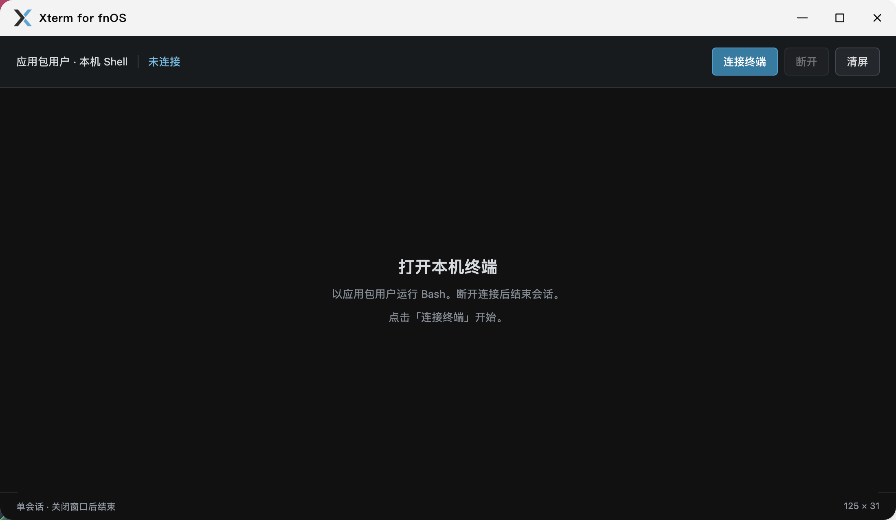
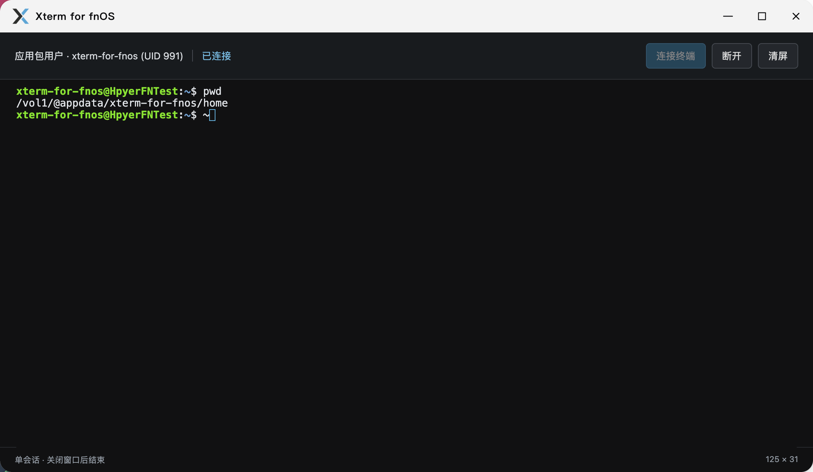
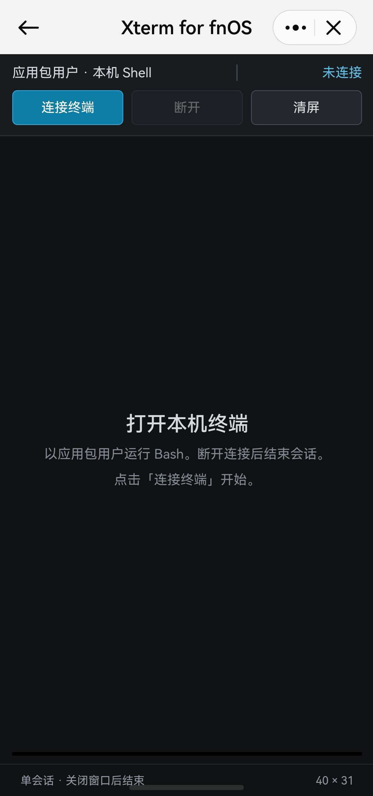
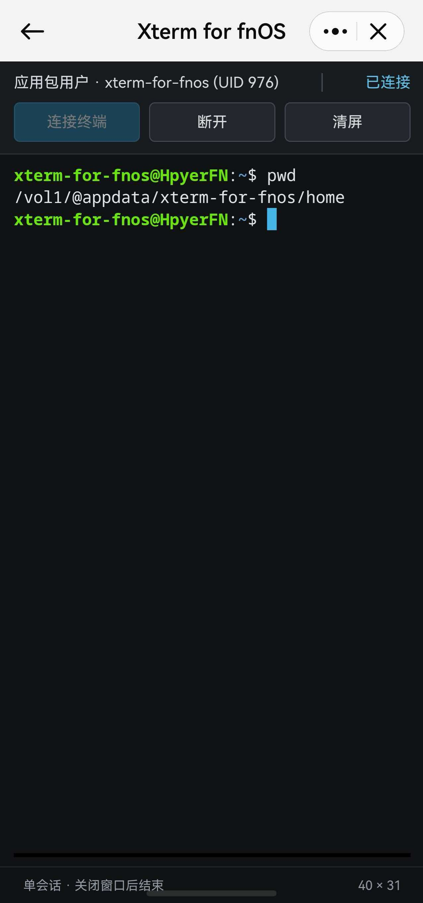

# Xterm for fnOS

管理员专用的 fnOS 原生终端。使用 xterm.js、Node.js 和 node-pty，在飞牛桌面窗口中运行本机 Bash，不依赖 Docker 或 SSH。

## 界面预览

<table>
  <tr>
    <td width="50%" align="center">
      <a href="screenshots/xterm-for-fnos-pc-1.png"></a><br>
      <sub>桌面端未连接界面</sub>
    </td>
    <td width="50%" align="center">
      <a href="screenshots/xterm-for-fnos-pc-2.png"></a><br>
      <sub>桌面端已连接界面</sub>
    </td>
  </tr>
  <tr>
    <td width="50%" align="center">
      <a href="screenshots/xterm-for-fnos-mobile-1.jpg"></a><br>
      <sub>移动端未连接界面</sub>
    </td>
    <td width="50%" align="center">
      <a href="screenshots/xterm-for-fnos-mobile-2.jpg"></a><br>
      <sub>移动端已连接界面</sub>
    </td>
  </tr>
</table>

- 通过飞牛统一网关访问，无需额外开放端口。
- Shell **以应用包用户运行**，不是当前登录的飞牛用户，也不是 root。页面显示实际账号和 UID。
- 需要管理员账号权限时，可在终端中执行 `su <管理员用户名>` 并由系统验证密码；应用不保存或代填账号凭据。
- 每个管理员最多一个连接，全应用最多四个；不同管理员的 Shell 仍共享同一个包用户和 HOME，不提供 OS 用户隔离。
- 支持中文、常见 emoji（含国旗组合字符）、终端尺寸调整、交互程序、Ctrl+C、清屏、断开与新建会话。
- xterm.js 原生支持 ANSI/256 色；终端默认启用常见的目录、链接、可执行文件颜色，以及 `ls`、`ll`、`la`、`l` 别名和彩色提示符。用户可在 `/vol1/@appshare/xterm-for-fnos/bashrc` 添加自定义命令和别名。
- 断开即回收会话；异常断网由心跳检测，通常在 30 秒内回收。没有会话保活或自动重连。
- HOME 为 `${TRIM_PKGVAR}/home`；Bash 不加载飞牛用户的 profile/bashrc，仅加载应用内置配置和 data-share 中的 `bashrc`，所有用户共享。

安装对应架构的 FPK，需要 fnOS ≥ 1.1.3100 与 `nodejs_v24`。打开「Xterm for fnOS」，点击「连接终端」。

## 本地开发

```sh
pnpm install
pnpm run dev xterm
```

打开 http://127.0.0.1:3082/app/xterm-for-fnos/ 。开发模式只绑定回环地址，以本机开发账号执行命令；它不会模拟 fnOS 包用户权限。数据写入运行目录下的 `.local/xterm`。

```sh
pnpm test
pnpm run build xterm
pnpm run pack xterm --arch x86
```

默认构建使用当前主机的原生模块。在 macOS 构建前端成功，不代表已具备 Linux 打包条件。缺少目标 Linux 模块时，打包器会拒绝生成 FPK。

Linux x64 / arm64 主机分别执行安装和构建，可获得本架构模块。CI 使用对应架构的 runner 构建，再由 x64 runner 调用 fnpack 打包，传输时保留文件执行权限。

macOS 可使用 Zig 0.14.1 和 Node 24 头文件交叉编译实验性模块：

```sh
node apps/xterm/build-native.mjs --zig /absolute/path/to/zig --headers /absolute/path/to/include/node
pnpm run build xterm
pnpm run pack xterm --all
```

交叉产物保存在 `.cache/xterm-native/linux-{x64,arm64}`。脚本以 glibc 2.31 为目标、使用 N-API 8；仍需验证 fnOS 实际 Node/系统库兼容性。Linux CI 原生构建的系统库要求由 runner 决定，不能以交叉包验证结果替代 CI 包验证。

[验收记录](docs/acceptance.md) · [架构与边界](docs/architecture.md)

应用图标取自 xterm.js 官网的黑蓝 X 标志。本应用是第三方 fnOS 集成；依赖许可证随应用包分发。
